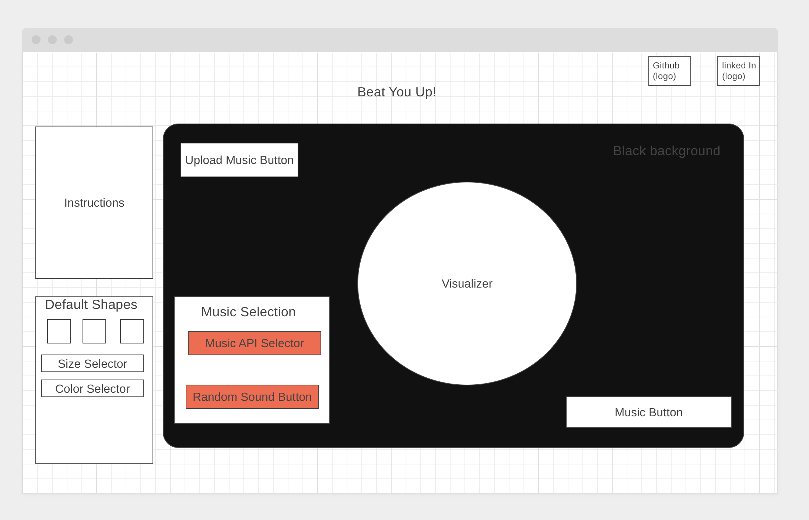

## Background

For my project, I want to create a song visualizer that will visualize songs based on BPM/ highs/ lows, and “dance”/bounce with the music. I will allow users to upload their own music using .wav or .mp3 files to convert them into a string to play the music or users can select music from one of these APIs that I will try my best to implement: SoundCloud API, Youtube Audio Library API, and Jamendo API. Users will be able to use music controllers (play/pause, skip, previous, fastword, volume up and down) to control the music in various ways. 

The visualizer will consist of different size, shapes (circles, rectangles, triangles) and colors. Users will be able to control those aspects of the visualizer and customize it to their liking. There will be prebuilt options but also some capability of customization.

## Functionality and MVPs

In Soundualizer, users will be able to:
Upload music or select sounds from one of the provided APIs
Visualize sound
Control visualizer size, shape, and color
In addition, this project will include:
Instructions
README
Link to my github and LinkedIn

## Technologies and APIs
+ [Web Audio API](https://developer.mozilla.org/en-US/docs/Web/API/Web_Audio_API)
+ [Canvas API](https://developer.mozilla.org/en-US/docs/Web/API/Canvas_API)
+ [Jamendo API](https://developer.jamendo.com/v3.0)
+ [Youtube Audio Library API](https://github.com/ThibaultJanBeyer/YouTube-Free-Audio-Library-API)

## Implementation Library

**Friday Afternoon and Weekend**: Build HTML file and begin working code functionality. Have the music controller portion finished, and hopefully start on canvas portion of project
**Monday**: Finish building canvas part of the visualizer and include Web Audio Frequency / frequency analyzer 
**Tuesday**: Complete visualizer aspect and make sure it links properly with music.
**Wednesday**: Styling and CSS
**Thursday Morning**: Double check all functionality and make sure it works properly

## Wireframe: 

